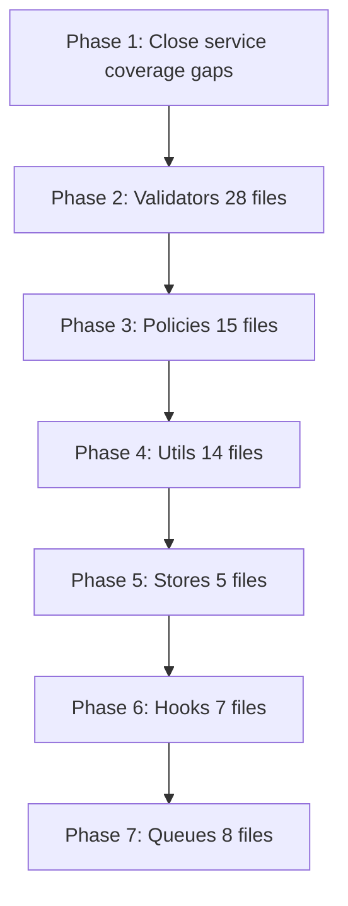

# Remaining Test Plan — Completion Roadmap

**Generated:** March 2, 2026  
**Sources:** `docs/audit/MASTER_TEST_PLAN.md`, `coverage_plan_complete_f5ccb18a.plan.md`, agent transcript [e04886f8]

---

## Executive Summary

The transcript and coverage plan show significant progress on **services** (74/74 have tests). The remaining work focuses on:

1. **Closing coverage gaps** in services that have tests but &lt;100% coverage
2. **Validators** — 28 of 42 still have no tests
3. **Policies** — 15 of 17 have no tests
4. **Utils** — ~17 files without tests
5. **Stores** — 5 stores, 0 tests
6. **Hooks** — 6 of 7 hooks without tests
7. **Queues/Workers** — 8 of 9 without tests
8. **API routes** — ~394 of 398 without tests (optional, large scope)

---

## What Was Done (from transcript & plan)

| Category | Status |
|----------|--------|
| **Services** | 74/74 have test files — ai-autofill, ai-content-generation, ai-validation, ai-spec-parser, ai-master-fill, blog, booking, equipment, invoice, quote, reports, studio, import-worker, image-sourcing, seo-generation, client, contract, product-equipment-sync, and 50+ more |
| **Validators** | 29 with tests: + **automation-rule, blog-ai, brand, business-recipient, hero-banner, kit, payment, reports, studio, warehouse** |
| **Utils** | 12 with tests: + **excel-parser** |
| **Policies** | 10 with tests: + **contract, coupon, delivery, invoice, payment, quote** |
| **Stores** | 4 with tests: + **checkout.store, compare-store** |
| **Auth** | auth-helpers, permissions |
| **Integrations** | tap, whatsapp, zatca |
| **API** | ai-routes, portal-bookings, sync-catalog-route |
| **Queue** | backfill.worker |
| **Middleware** | middleware.test.ts |

---

## Phase 1: Close Coverage Gaps (Services with &lt;100%)

Services that have tests but need more cases to reach higher coverage:

| File | Target | Action |
|------|--------|-------|
| ai.service.ts | ~53% → 80%+ | Add tests for remaining branches |
| blog.service.ts | ~77% → 100% | Add tests for create/update/delete paths |
| ai-master-fill.service.ts | ~99.5% → 100% | Cover lines 136, 155, 387 in runMasterFill |
| template-renderer.service.ts | ~66% → 90%+ | Add edge-case tests |
| product-catalog.service.ts | ~70% → 90%+ | Add missing branches |
| content-health.service.ts | partial | Raise coverage |
| product-equipment-sync.service.ts | ~46% → 80%+ | Add sync/conflict tests |
| booking.service.ts | ~14% → 60%+ | Add create/confirm/cancel flows |
| invoice.service.ts | partial | Add invoice generation tests |
| payment.service.ts | partial | Add payment flow tests |
| web-researcher.service.ts | ~33% → 70%+ | Add fetch/parse tests |
| quality-scorer.service.ts | ~95% → 100% | Cover remaining branches |
| warehouse.service.ts | ~94% → 100% | Cover remaining branches |
| specs-db.service.ts | ~96.5% → 100% | Close gaps |
| column-mapper.service.ts | ~97.6% → 100% | Close gaps |
| faq.service.ts | ~92% → 100% | Close gaps |

**Order:** Start with high-value P1 services (ai.service, booking.service, invoice.service, payment.service), then close near-100% files.

---

## Phase 2: Validators (28 without tests)

| Validator | Priority | Action |
|-----------|----------|--------|
| equipment.validator.ts | P1 | ✅ Done |
| auth.validator.ts | P1 | ✅ Done |
| contract.validator.ts | P1 | ✅ Done |
| quote.validator.ts | P1 | ✅ Done |
| invoice.validator.ts | P1 | ✅ Done |
| checkout-form.validator.ts | P1 | ✅ Done |
| coupon.validator.ts | P1 | ✅ Done |
| delivery.validator.ts | P1 | ✅ Done |
| shoot-type.validator.ts | P1 | ✅ Done |
| ai.validator.ts | P2 | Create `ai.validator.test.ts` |
| automation-rule.validator.ts | P2 | Create test file |
| blog-ai.validator.ts | P2 | Create test file |
| brand.validator.ts | P2 | Create test file |
| business-recipient.validator.ts | P2 | Create test file |
| checkout.validator.ts | P2 | Create test file |
| client.validator.ts | P2 | Create test file |
| customer-segment.validator.ts | P2 | Create test file |
| damage-claim.validator.ts | P2 | Create test file |
| footer.validator.ts | P2 | Create test file |
| hero-banner.validator.ts | P2 | Create test file |
| kit.validator.ts | P2 | Create test file |
| maintenance.validator.ts | P2 | Create test file |
| marketing.validator.ts | P2 | Create test file |
| notification-template.validator.ts | P2 | Create test file |
| payment.validator.ts | P2 | Create test file |
| policy.validator.ts | P2 | Create test file |
| pricing-rule.validator.ts | P2 | Create test file |
| promissory-note.validator.ts | P2 | Create test file |
| recurring.validator.ts | P2 | Create test file |
| reports.validator.ts | P2 | Create test file |
| review.validator.ts | P2 | Create test file |
| studio-faq.validator.ts | P2 | Create test file |
| studio-package.validator.ts | P2 | Create test file |
| studio-testimonial.validator.ts | P2 | Create test file |
| studio.validator.ts | P2 | Create test file |
| verification.validator.ts | P2 | Create test file |
| warehouse.validator.ts | P2 | Create test file |

**Pattern:** Each validator test should cover: valid input, invalid input, edge cases (empty, max length, special chars).

---

## Phase 3: Policies (15 without tests)

| Policy | Action |
|--------|--------|
| ai.policy.ts | Create `ai.policy.test.ts` |
| base.policy.ts | Create test file |
| client.policy.ts | Create test file |
| contract.policy.ts | Create test file |
| coupon.policy.ts | Create test file |
| delivery.policy.ts | Create test file |
| invoice.policy.ts | Create test file |
| maintenance.policy.ts | Create test file |
| marketing.policy.ts | Create test file |
| payment.policy.ts | Create test file |
| quote.policy.ts | Create test file |
| reports.policy.ts | Create test file |
| warehouse.policy.ts | Create test file |

**Pattern:** Test `canCreate`, `canUpdate`, `canDelete`, `canView` for different roles and resource states.

---

## Phase 4: Utils (~17 without tests)

| File | Action |
|------|--------|
| excel-parser.ts | Create `excel-parser.test.ts` |
| rate-limit-upstash.ts | Create test file |
| sku-generator.ts | Create test file |
| equipment-fuzzy-matcher.ts | Create test file |
| fetch-page-text.ts | Create test file |
| letter-template.utils.ts | Create test file |
| export.utils.ts | Create test file |
| blog-preview.ts | Create test file |
| public-feature-flags.ts | Create test file |
| image.utils.ts | Create test file |
| circuit-breaker.ts | Create test file |
| cost-tracker.ts | Create test file |
| check-translations.ts | Create test file |
| mock-data.ts | Optional (test data factory) |

---

## Phase 5: Stores (5 files, 0 tests)

| Store | Action |
|-------|--------|
| kit-wizard.store.ts | Create `kit-wizard.store.test.ts` |
| cart.store.ts | Create test file |
| checkout.store.ts | Create test file |
| compare-store.ts | Create test file |
| locale.store.ts | Create test file |

**Pattern:** Test initial state, actions, selectors. Use Zustand's `setState` for isolation.

---

## Phase 6: Hooks (6 without tests)

| Hook | Action |
|------|--------|
| use-job-stream.ts | Create `use-job-stream.test.ts` |
| use-toast.ts | Create test file |
| use-permissions.ts | Create test file |
| use-locale.ts | Create test file |
| use-admin-feature-flags.ts | Create test file |
| use-admin-live.ts | Create test file |
| use-kit-queries.ts | Create test file |

**Pattern:** Use `@testing-library/react-hooks` or renderHook; mock dependencies.

---

## Phase 7: Queues & Workers (8 without tests)

| File | Action |
|------|--------|
| ai-processing.queue.ts | Create test file |
| ai-processing.worker.ts | Create test file |
| dead-letter.queue.ts | Create test file |
| image-processing.queue.ts | Create test file |
| image-processing.worker.ts | Create test file |
| import.queue.ts | Create test file |
| import.worker.ts | Create test file |
| redis.client.ts | Create test file |

---

## Phase 8: PDF Helpers (optional)

| File | Action |
|------|--------|
| pdf/invoice-pdf.ts | Create test or extend pdf.service.test |
| pdf/contract-pdf.ts | Same |
| pdf/promissory-note-pdf.ts | Same |
| pdf/quote-pdf.ts | Same |
| pdf/report-export.ts | Same |

---

## Phase 9: API Routes (optional, large scope)

- ~398 routes total
- ~4 have tests
- Priority domains: admin/ai, admin/blog, bookings, cart, checkout, quotes, invoices, payments

---

## Phase 10: Components & Pages (deferred)

- 266 components, 222 pages
- Execute after Phases 1–8

---

## Execution Order (Recommended)



---

## Commands

```bash
# Run all tests
npm test

# Run with coverage
npm test -- --coverage

# Run specific pattern
npm test -- --testPathPattern="booking.service"
npm test -- --testPathPattern="equipment.validator"
```

---

## Summary Counts

| Category | Total | With Tests | Without Tests |
|----------|-------|------------|---------------|
| Services | 74 | 74 | 0 (gaps only) |
| Validators | 42 | 29 | 13 |
| Policies | 17 | 10 | 7 |
| Utils | 24 | 12 | ~12 |
| Stores | 5 | 4 | 1 |
| Hooks | 8 | 1 | 7 |
| Queue/Workers | 10 | 1 | 9 |
| Middleware | 1 | 1 | 0 |
