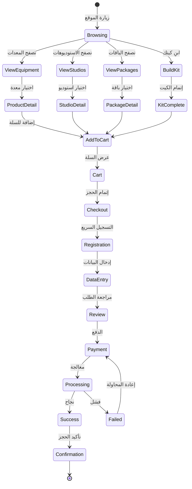
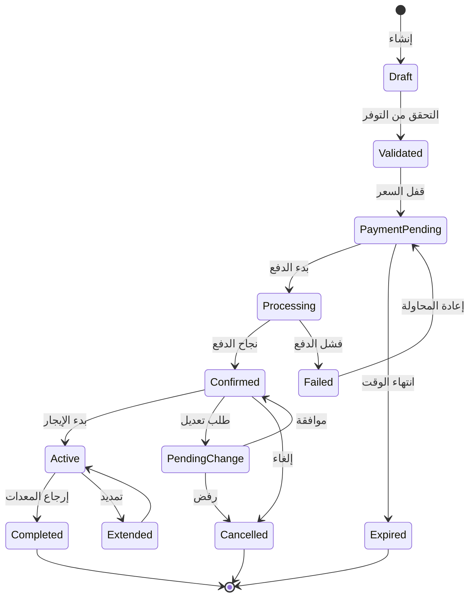
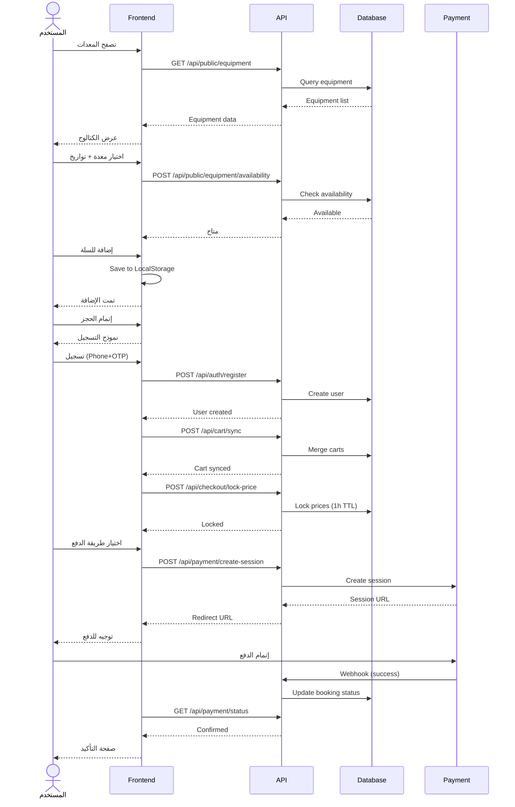
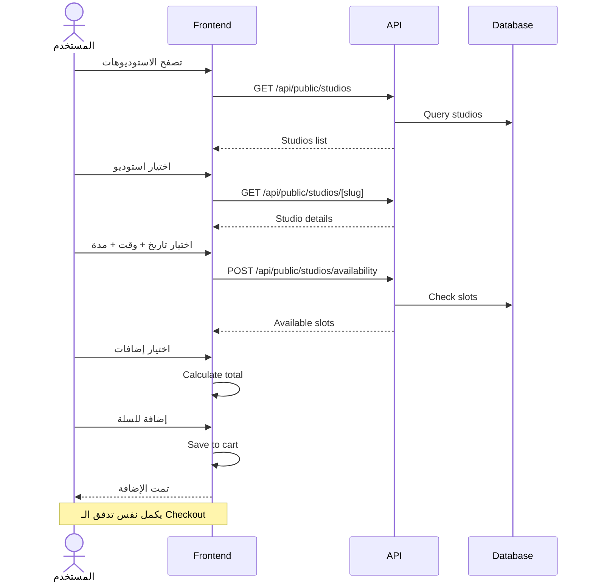
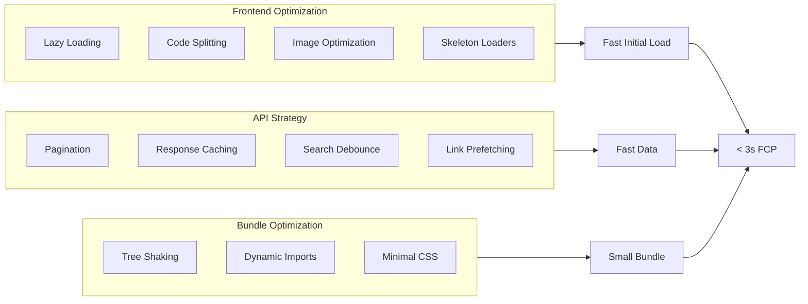
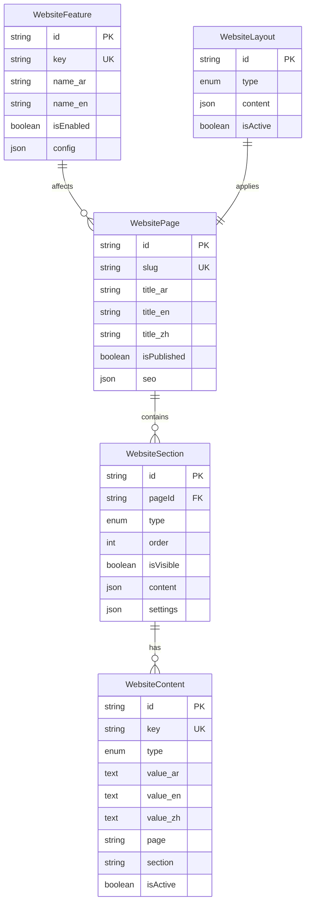

# FlixCam.rent - خطة بناء الموقع العام الشاملة (Production-Ready)

## نظرة عامة

بناء موقع عام **Production-Ready** لمنصة تأجير معدات سينمائية واستوديوهات.

### معلومات المشروع

| الجانب             | الوصف                                         |
| ------------------ | --------------------------------------------- |
| **الجدول الزمني**  | 25 أسبوع (~6 أشهر)                            |
| **التنفيذ**        | بالتوازي (الأمان + الميزات)                   |
| **الفريق المقترح** | 2-3 Full-stack + 1 DevOps + 1 QA + 1 Designer |

### المميزات الرئيسية

- **Production-Ready**: أمان، مراقبة، اختبار شامل
- **ديناميكي 100%**: كل المحتوى من قاعدة البيانات
- **خفيف وسريع**: Lazy loading, Code splitting, Redis caching
- **متعدد اللغات**: عربي (RTL) + إنجليزي + صيني
- **تسجيل مؤجل**: التصفح كضيف، التسجيل عند Checkout
- **Business Logic كامل**: Overbooking protection, Tax 15%, Late fees, Damage handling

### تقييم الجودة (Gap Analysis)

| الجانب         | قبل        | بعد        |
| -------------- | ---------- | ---------- |
| الأمان         | 0/10       | 9/10       |
| المراقبة       | 0/10       | 9/10       |
| الاختبار       | 1/10       | 9/10       |
| Business Logic | 3/10       | 9/10       |
| **الإجمالي**   | **45/100** | **90/100** |

---

## المرحلة 0: الأمان والمراقبة (Week 1-2) - CRITICAL

### 0.1 Security Headers

```typescript
// next.config.js
const securityHeaders = [
  { key: 'X-DNS-Prefetch-Control', value: 'on' },
  { key: 'Strict-Transport-Security', value: 'max-age=63072000; includeSubDomains; preload' },
  { key: 'X-Frame-Options', value: 'SAMEORIGIN' },
  { key: 'X-Content-Type-Options', value: 'nosniff' },
  { key: 'X-XSS-Protection', value: '1; mode=block' },
  { key: 'Referrer-Policy', value: 'origin-when-cross-origin' },
]
```

### 0.2 Rate Limiting (Upstash Redis)

| Endpoint      | Limit       |
| ------------- | ----------- |
| Public APIs   | 100 req/min |
| Authenticated | 300 req/min |
| Checkout      | 10 req/min  |
| Payment       | 5 req/5min  |

### 0.3 Session Management

- Secure cookies (httpOnly, sameSite: lax)
- 24 hour max age
- 30 min inactivity timeout
- Session hijacking protection

### 0.4 Error Tracking (Sentry)

- Real-time error tracking
- Performance monitoring
- User context (filtered)
- Alerting on critical errors

### 0.5 Structured Logging (Winston)

- JSON format
- Request/response logging
- Error severity levels
- Log aggregation ready

### 0.6 Redis Caching Layer

| Data             | TTL        |
| ---------------- | ---------- |
| Website Content  | 1 hour     |
| Equipment List   | 5 minutes  |
| Equipment Detail | 10 minutes |
| Availability     | 1 minute   |
| Cart             | 15 minutes |

### 0.7 PDPL/Privacy Compliance

- Privacy Policy (سياسة الخصوصية)
- Cookie Consent Banner
- Data Export Functionality
- Data Deletion Capability
- Terms of Service

---

## المخطط المعماري العام

```mermaid
flowchart TB
    subgraph Client[Frontend - Next.js]
        PublicPages[Public Pages]
        ClientPortal[Client Portal /me]
        Components[UI Components]
        LocalCart[Local Cart - Zustand]
    end

    subgraph API[API Layer]
        PublicAPI[/api/public/*]
        CartAPI[/api/cart/*]
        CheckoutAPI[/api/checkout/*]
        PaymentAPI[/api/payment/*]
        MeAPI[/api/me/*]
    end

    subgraph Services[Business Logic]
        EquipmentService[Equipment Service]
        StudioService[Studio Service]
        BookingService[Booking Service]
        PaymentService[Payment Service]
        CartService[Cart Service]
    end

    subgraph DB[Database - PostgreSQL]
        Equipment[(Equipment)]
        Studio[(Studio)]
        Booking[(Booking)]
        Cart[(Cart)]
        WebsiteContent[(Website Content)]
    end

    subgraph External[External Services]
        TAP[TAP Payment]
        OTP[OTP Provider]
        WhatsApp[WhatsApp API]
        Email[Email Service]
    end

    PublicPages --> PublicAPI
    PublicPages --> LocalCart
    ClientPortal --> MeAPI
    LocalCart --> CartAPI
    PublicAPI --> Services
    CartAPI --> CartService
    CheckoutAPI --> BookingService
    PaymentAPI --> PaymentService
    Services --> DB
    PaymentService --> TAP
    BookingService --> OTP
    BookingService --> WhatsApp
    BookingService --> Email
```

---

## رحلة المستخدم الكاملة



---

## State Machine - حالات الحجز



---

## User Stories - قصص المستخدم

### US-01: تصفح المعدات

**كـ** زائر  
**أريد** تصفح كتالوج المعدات مع الفلاتر  
**لكي** أجد ما يناسب مشروعي

**معايير القبول:**

- عرض Grid/List toggle
- فلاتر: فئة، ماركة، سعر، توفر
- بطاقة تعرض: صورة، اسم، سعر، توفر
- Lazy loading للصور
- Skeleton loader أثناء التحميل

### US-02: إضافة للسلة

**كـ** زائر  
**أريد** إضافة معدات للسلة بدون تسجيل  
**لكي** أكمل تجميع طلبي قبل الالتزام

**معايير القبول:**

- اختيار التواريخ قبل الإضافة
- التحقق من التوفر فوراً
- حفظ السلة في LocalStorage
- عرض رسالة نجاح
- تحديث عداد السلة

### US-03: التسجيل المؤجل

**كـ** زائر لديه سلة  
**أريد** التسجيل بسرعة عند Checkout  
**لكي** لا أضيع وقتي بتسجيل مبكر

**معايير القبول:**

- 3 طرق: Email+Password | Phone+OTP | Google/Apple
- أقل من 30 ثانية للتسجيل
- التحقق من Email بعد الدفع (non-blocking)
- دمج السلة المحلية مع السيرفر
- حفظ Return URL

### US-04: إتمام الدفع

**كـ** مستخدم مسجل  
**أريد** إتمام الدفع بأمان  
**لكي** أؤكد حجزي

**معايير القبول:**

- قفل السعر لمدة ساعة
- عرض ملخص واضح
- طرق دفع متعددة
- منع الدفع المزدوج
- معالجة Callback المتأخر

### US-05: إدارة الحجز

**كـ** عميل لديه حجز  
**أريد** تعديل أو تمديد أو إلغاء حجزي  
**لكي** أتعامل مع تغييرات مشروعي

**معايير القبول:**

- عرض حالة الحجز بوضوح
- طلب تعديل مع توفر
- طلب تمديد مع السعر الجديد
- إلغاء حسب السياسة
- تواصل مع الدعم بالسياق

---

## Use Cases - حالات الاستخدام

### UC-01: حجز معدة



### UC-02: حجز استوديو



---

## Test Cases - حالات الاختبار

### TC-BROWSE: تصفح الكتالوج

| ID     | السيناريو          | الخطوات            | النتيجة المتوقعة           | الأولوية |
| ------ | ------------------ | ------------------ | -------------------------- | -------- |
| TC-B01 | تحميل صفحة المعدات | فتح /equipment     | عرض Grid + Filters في < 2s | Critical |
| TC-B02 | فلترة بالفئة       | اختيار "كاميرات"   | عرض الكاميرات فقط          | High     |
| TC-B03 | فلترة بالماركة     | اختيار "Sony"      | عرض Sony فقط               | High     |
| TC-B04 | فلترة بالسعر       | 100-500 ريال       | عرض ضمن النطاق             | Medium   |
| TC-B05 | فلترة بالتوفر      | "متاح فقط"         | إخفاء غير المتاح           | High     |
| TC-B06 | ترتيب بالسعر       | تصاعدي             | ترتيب صحيح                 | Medium   |
| TC-B07 | Toggle Grid/List   | الضغط على الأيقونة | تغيير العرض                | Low      |
| TC-B08 | Lazy loading       | التمرير لأسفل      | تحميل المزيد               | High     |
| TC-B09 | حالة فارغة         | فلتر بدون نتائج    | رسالة "لا توجد نتائج"      | Medium   |
| TC-B10 | خطأ في API         | فشل الاتصال        | رسالة خطأ + إعادة          | High     |

### TC-CART: السلة

| ID     | السيناريو         | الخطوات            | النتيجة المتوقعة         | الأولوية |
| ------ | ----------------- | ------------------ | ------------------------ | -------- |
| TC-C01 | إضافة معدة        | تواريخ + إضافة     | تُضاف مع السعر           | Critical |
| TC-C02 | إضافة بدون تواريخ | إضافة مباشرة       | رسالة "اختر التواريخ"    | High     |
| TC-C03 | إضافة غير متاح    | معدة محجوزة        | رسالة "غير متاح" + بدائل | High     |
| TC-C04 | تعديل الكمية      | +/-                | تحديث السعر والتوفر      | High     |
| TC-C05 | حذف عنصر          | حذف                | إزالة + تحديث الإجمالي   | High     |
| TC-C06 | تطبيق كوبون       | كود صحيح           | خصم يظهر                 | High     |
| TC-C07 | كوبون خاطئ        | كود خاطئ           | رسالة خطأ                | Medium   |
| TC-C08 | كوبون منتهي       | كود منتهي          | رسالة "منتهي الصلاحية"   | Medium   |
| TC-C09 | Refresh الصفحة    | تحديث              | السلة محفوظة             | Critical |
| TC-C10 | سلة فارغة         | حذف الكل           | رسالة + CTA للتصفح       | Medium   |
| TC-C11 | Revalidation      | عنصر يصبح غير متاح | إشعار + خيارات           | High     |
| TC-C12 | سلة مختلطة        | معدات + استوديو    | كلاهما في السلة          | High     |

### TC-CHECKOUT: إتمام الطلب

| ID      | السيناريو            | الخطوات            | النتيجة المتوقعة      | الأولوية |
| ------- | -------------------- | ------------------ | --------------------- | -------- |
| TC-CH01 | تسجيل Email+Password | إدخال + تسجيل      | حساب + انتقال         | Critical |
| TC-CH02 | تسجيل Phone+OTP      | جوال + OTP         | حساب + انتقال         | Critical |
| TC-CH03 | تسجيل Google         | OAuth              | حساب + انتقال         | High     |
| TC-CH04 | OTP خاطئ             | كود خاطئ           | رسالة + إعادة         | High     |
| TC-CH05 | OTP منتهي            | كود منتهي          | "انتهى" + إعادة إرسال | Medium   |
| TC-CH06 | قفل السعر            | بدء Checkout       | قفل + عداد            | Critical |
| TC-CH07 | انتهاء القفل         | مرور ساعة          | رسالة + إعادة التأكيد | High     |
| TC-CH08 | ملء البيانات         | اسم + جوال + إيميل | تحقق فوري             | High     |
| TC-CH09 | التحقق من الهوية     | رفع صورة           | قبول                  | High     |
| TC-CH10 | الشروط والأحكام      | قبول الشروط        | تفعيل زر الدفع        | Critical |
| TC-CH11 | اختيار التوصيل       | توصيل/استلام       | تحديث الإجمالي        | Medium   |
| TC-CH12 | Return URL           | تسجيل من صفحة معدة | رجوع + تواريخ محفوظة  | High     |

### TC-PAYMENT: الدفع

| ID     | السيناريو       | الخطوات         | النتيجة المتوقعة          | الأولوية |
| ------ | --------------- | --------------- | ------------------------- | -------- |
| TC-P01 | دفع بطاقة       | إدخال + دفع     | نجاح + تأكيد              | Critical |
| TC-P02 | Apple Pay       | اختيار + تأكيد  | نجاح + تأكيد              | High     |
| TC-P03 | STC Pay         | اختيار + تأكيد  | نجاح + تأكيد              | High     |
| TC-P04 | Tabby تقسيط     | اختيار + تأكيد  | نجاح + تأكيد              | High     |
| TC-P05 | بطاقة مرفوضة    | بطاقة خاطئة     | رسالة + إعادة             | High     |
| TC-P06 | رصيد غير كافي   | بطاقة فارغة     | رسالة + إعادة             | High     |
| TC-P07 | Callback متأخر  | تأخر webhook    | "جاري المعالجة" + polling | Critical |
| TC-P08 | Polling timeout | 5 دقائق بدون رد | رسالة + دعم               | High     |
| TC-P09 | دفع مزدوج       | ضغط مرتين       | جلسة واحدة فقط            | Critical |
| TC-P10 | انتهاء الجلسة   | تأخر طويل       | رسالة + إعادة             | High     |
| TC-P11 | تحويل بنكي      | اختيار تحويل    | تعليمات + WhatsApp        | Medium   |
| TC-P12 | إلغاء الدفع     | إلغاء           | رجوع للـ Checkout         | Medium   |

### TC-PORTAL: بوابة العميل

| ID      | السيناريو     | الخطوات              | النتيجة المتوقعة  | الأولوية |
| ------- | ------------- | -------------------- | ----------------- | -------- |
| TC-PO01 | عرض الحجوزات  | فتح /me/bookings     | قائمة الحجوزات    | Critical |
| TC-PO02 | فلترة بالحالة | "مؤكد"               | المؤكدة فقط       | Medium   |
| TC-PO03 | تفاصيل الحجز  | فتح حجز              | كل التفاصيل       | High     |
| TC-PO04 | تحميل PDF     | ضغط تحميل            | ملف PDF           | High     |
| TC-PO05 | إضافة للتقويم | ضغط الزر             | إضافة ناجحة       | Medium   |
| TC-PO06 | طلب تعديل     | نموذج + إرسال        | طلب مرسل          | High     |
| TC-PO07 | طلب تمديد     | نموذج + توفر + إرسال | طلب مرسل          | High     |
| TC-PO08 | إلغاء مسموح   | قبل 48 ساعة          | إلغاء + استرداد   | High     |
| TC-PO09 | إلغاء ممنوع   | بعد البدء            | رسالة "غير مسموح" | High     |
| TC-PO10 | إعادة الحجز   | ضغط الزر             | سلة معبأة         | Medium   |
| TC-PO11 | تقييم         | بعد الانتهاء         | حفظ التقييم       | Medium   |
| TC-PO12 | WhatsApp دعم  | ضغط الزر             | رسالة بالسياق     | High     |

---

## UX/UI Guidelines

### مبادئ التصميم

1. **Mobile-First**: تصميم للموبايل أولاً ثم التوسع
2. **RTL-Ready**: دعم كامل للعربية من البداية
3. **One CTA per Section**: زر رئيسي واحد لكل قسم
4. **Price Transparency**: السعر واضح دائماً
5. **Feedback Loops**: رد فعل لكل إجراء

### مخطط الصفحة الرئيسية

```mermaid
flowchart TB
    subgraph Header[Header - Fixed]
        Logo[Logo]
        Nav[Navigation]
        LangSwitch[Language]
        CartIcon[Cart Icon]
        Account[Account]
    end

    subgraph Hero[Hero Section]
        HeroTitle[العنوان الرئيسي]
        HeroSub[الوصف]
        SearchBar[بحث سريع]
        QuickPaths[مسارات سريعة]
    end

    subgraph Featured[Featured Equipment]
        FeaturedGrid[Grid 4 items]
        ViewAll[عرض الكل]
    end

    subgraph Studios[Studios Teaser]
        StudioCards[3 Studio Cards]
        StudioCTA[استكشف الاستوديوهات]
    end

    subgraph HowItWorks[How It Works]
        Step1[1. اختر]
        Step2[2. احجز]
        Step3[3. استلم]
    end

    subgraph Packages[Packages]
        PackageCards[Package Cards]
        PackageCTA[عرض الباقات]
    end

    subgraph Testimonials[Testimonials]
        Reviews[آراء العملاء]
    end

    subgraph Brands[Trusted Brands]
        BrandLogos[شعارات الماركات]
    end

    subgraph FAQ[FAQ Section]
        Questions[الأسئلة الشائعة]
    end

    subgraph CTA[CTA Banner]
        CTAText[جاهز للبدء؟]
        CTAButton[احجز الآن]
    end

    subgraph Footer[Footer]
        Links[الروابط]
        Social[التواصل الاجتماعي]
        Copyright[حقوق النشر]
    end

    Header --> Hero
    Hero --> Featured
    Featured --> Studios
    Studios --> HowItWorks
    HowItWorks --> Packages
    Packages --> Testimonials
    Testimonials --> Brands
    Brands --> FAQ
    FAQ --> CTA
    CTA --> Footer
```



### Component States

كل Component يجب أن يدعم:

- **Loading**: Skeleton loader
- **Empty**: رسالة + CTA
- **Error**: رسالة خطأ + إعادة المحاولة
- **Success**: تأكيد بصري

---

## Performance Optimization

### استراتيجية الأداء



### تقنيات التحسين

| التقنية               | التطبيق                 | الأثر               |
| --------------------- | ----------------------- | ------------------- |
| **Next/Image**        | جميع الصور              | تحسين تلقائي + lazy |
| **Dynamic Import**    | الـ Dialogs والـ Modals | تقليل Bundle        |
| **Server Components** | صفحات الكتالوج          | SSR سريع            |
| **Skeleton UI**       | قوائم وبطاقات           | UX أفضل             |
| **SWR/TanStack**      | البيانات المتكررة       | Caching ذكي         |
| **Pagination**        | قوائم طويلة             | تحميل أسرع          |
| **Debounce**          | البحث والفلاتر          | طلبات أقل           |
| **Prefetch**          | الروابط الظاهرة         | تنقل فوري           |

---

## Dynamic Content Architecture

### نظام المحتوى الديناميكي



### Feature Flags

| الميزة              | الوصف           | التحكم      |
| ------------------- | --------------- | ----------- |
| `equipment_catalog` | كتالوج المعدات  | تفعيل/تعطيل |
| `studios`           | الاستوديوهات    | تفعيل/تعطيل |
| `packages`          | الباقات         | تفعيل/تعطيل |
| `build_your_kit`    | ابنِ كيتك       | تفعيل/تعطيل |
| `recommendations`   | التوصيات        | تفعيل/تعطيل |
| `reviews`           | التقييمات       | تفعيل/تعطيل |
| `installments`      | التقسيط         | تفعيل/تعطيل |
| `newsletter`        | النشرة البريدية | تفعيل/تعطيل |

---

## API Structure

### Public APIs (No Auth)

```
/api/public/
├── equipment/
│   ├── GET /                    # قائمة المعدات + فلاتر
│   ├── GET /[id]                # تفاصيل معدة
│   ├── POST /[id]/availability  # التحقق من التوفر
│   └── GET /featured            # المعدات المميزة
├── categories/
│   └── GET /                    # قائمة الفئات
├── brands/
│   └── GET /                    # قائمة الماركات
├── studios/
│   ├── GET /                    # قائمة الاستوديوهات
│   ├── GET /[slug]              # تفاصيل استوديو
│   └── POST /[slug]/availability # توفر الاستوديو
├── packages/
│   ├── GET /                    # قائمة الباقات
│   └── GET /[slug]              # تفاصيل باقة
├── recommendations/
│   └── GET /[equipmentId]       # توصيات للمعدة
├── content/
│   └── GET /[page]              # محتوى الصفحة
└── features/
    └── GET /                    # Feature flags
```

### Authenticated APIs

```
/api/cart/
├── GET /              # السلة الحالية
├── POST /             # إضافة عنصر
├── PATCH /[itemId]    # تعديل عنصر
├── DELETE /[itemId]   # حذف عنصر
├── POST /sync         # دمج السلة
├── POST /coupon       # تطبيق كوبون
└── POST /revalidate   # إعادة التحقق

/api/checkout/
├── POST /lock-price        # قفل السعر
├── POST /verify-identity   # التحقق من الهوية
└── POST /create            # إنشاء الحجز

/api/payment/
├── POST /create-session    # إنشاء جلسة دفع
├── GET /status/[id]        # حالة الدفع
└── POST /webhook           # Callback من البوابة

/api/me/
├── GET /bookings                    # حجوزاتي
├── GET /bookings/[id]               # تفاصيل حجز
├── POST /bookings/[id]/change       # طلب تعديل
├── POST /bookings/[id]/extend       # طلب تمديد
├── POST /bookings/[id]/cancel       # إلغاء
├── GET /documents                   # المستندات
├── GET /profile                     # الملف الشخصي
└── PATCH /profile                   # تحديث الملف
```

---

## File Structure

### Routes Structure

```
src/app/
├── (public)/                        # Public Website
│   ├── layout.tsx                   # Header + Footer
│   ├── page.tsx                     # Home
│   ├── equipment/
│   │   ├── page.tsx                 # Catalog
│   │   ├── [category]/page.tsx      # Category
│   │   └── [slug]/page.tsx          # Details
│   ├── studios/
│   │   ├── page.tsx                 # List
│   │   └── [slug]/
│   │       ├── page.tsx             # Details
│   │       └── book/page.tsx        # Booking
│   ├── packages/
│   │   ├── page.tsx                 # List
│   │   └── [slug]/page.tsx          # Details
│   ├── build-your-kit/page.tsx      # Kit Wizard
│   ├── cart/page.tsx                # Cart
│   ├── checkout/page.tsx            # Checkout
│   ├── payment/
│   │   ├── redirect/page.tsx
│   │   └── processing/page.tsx
│   ├── booking/
│   │   └── confirmation/[id]/page.tsx
│   ├── support/page.tsx
│   ├── how-it-works/page.tsx
│   └── policies/page.tsx
├── me/                              # Client Portal
│   ├── layout.tsx
│   ├── page.tsx                     # Dashboard
│   ├── bookings/
│   │   ├── page.tsx                 # List
│   │   └── [id]/page.tsx            # Details
│   ├── documents/page.tsx
│   ├── profile/page.tsx
│   ├── wallet/page.tsx
│   └── notifications/page.tsx
├── (auth)/                          # Auth (existing)
│   ├── login/page.tsx
│   ├── register/page.tsx
│   ├── forgot-password/page.tsx
│   └── verify-email/page.tsx
└── admin/(routes)/
    └── website-settings/            # CMS Admin
        ├── pages/
        ├── layout/
        ├── features/
        ├── checkout/
        ├── payments/
        └── otp-providers/
```

### Components Structure

```
src/components/
├── public/                          # Public Layout
│   ├── public-header.tsx
│   ├── public-footer.tsx
│   ├── public-nav.tsx
│   ├── language-switcher.tsx
│   ├── mini-cart.tsx
│   ├── mobile-nav.tsx
│   └── whatsapp-cta.tsx
├── features/
│   ├── equipment/
│   │   ├── equipment-grid.tsx
│   │   ├── equipment-card.tsx
│   │   ├── equipment-filters.tsx
│   │   ├── equipment-detail.tsx
│   │   ├── equipment-gallery.tsx
│   │   ├── equipment-price-block.tsx
│   │   ├── availability-badge.tsx
│   │   └── recommended-equipment.tsx
│   ├── studio/
│   │   ├── studio-grid.tsx
│   │   ├── studio-card.tsx
│   │   ├── studio-detail.tsx
│   │   ├── studio-booking-form.tsx
│   │   └── studio-slot-picker.tsx
│   ├── packages/
│   │   ├── package-grid.tsx
│   │   ├── package-card.tsx
│   │   └── package-detail.tsx
│   ├── build-your-kit/
│   │   ├── kit-wizard.tsx
│   │   └── kit-step-*.tsx
│   ├── cart/
│   │   ├── cart-list.tsx
│   │   ├── cart-item.tsx
│   │   ├── cart-summary.tsx
│   │   └── cart-drawer.tsx
│   ├── checkout/
│   │   ├── checkout-form.tsx
│   │   ├── checkout-steps.tsx
│   │   ├── price-breakdown.tsx
│   │   ├── price-lock-notice.tsx
│   │   ├── coupon-field.tsx
│   │   └── registration-options.tsx
│   ├── payment/
│   │   ├── payment-methods.tsx
│   │   ├── payment-processing.tsx
│   │   └── payment-status.tsx
│   ├── booking/
│   │   ├── booking-confirmation.tsx
│   │   └── booking-summary.tsx
│   ├── portal/
│   │   ├── booking-list.tsx
│   │   ├── booking-card.tsx
│   │   ├── booking-detail.tsx
│   │   ├── booking-actions.tsx
│   │   ├── change-request-form.tsx
│   │   └── extension-request-form.tsx
│   └── support/
│       ├── booking-tracker.tsx
│       └── support-form.tsx
├── shared/                          # Reusable
│   ├── price-display.tsx
│   ├── date-picker.tsx
│   ├── date-range-picker.tsx
│   ├── image-gallery.tsx
│   └── rating-stars.tsx
└── states/                          # State Components
    ├── loading-state.tsx
    ├── empty-state.tsx
    └── error-state.tsx
```

---

## Implementation Phases (25 Weeks)

### المرحلة 0: الأمان والمراقبة (Week 1-2) - CRITICAL

- Security Headers (CSP, CORS, XSS, HTTPS)
- Rate Limiting (Upstash Redis)
- Session Management (Secure cookies)
- Error Tracking (Sentry)
- Structured Logging (Winston)
- Redis Caching Layer
- Privacy Policy + Cookie Consent

### المرحلة 1: البنية التحتية (Week 3-4)

- Database Models + Audit Fields + Soft Delete + Indexes
- Route Group (public)
- i18n (AR/EN/ZH) + RTL
- Public Layout
- Public APIs + API Versioning
- Standardized Error Handling

### المرحلة 2: الكتالوج والتصفح (Week 5-8)

- الصفحة الرئيسية (كل الأقسام)
- كتالوج المعدات + الفلاتر + Skeleton + Pagination
- صفحة تفاصيل المعدة + Gallery + Recommendations
- صفحات الاستوديوهات + Slot Picker
- صفحة الباقات
- Build Your Kit Wizard (7 Steps)
- SEO Meta Tags + Schema.org
- Accessibility (WCAG AA)

### المرحلة 3: السلة والـ Checkout (Week 9-12) - CRITICAL BUSINESS LOGIC

- نظام السلة (Local + Server Sync)
- Checkout (3 خطوات) + التسجيل المؤجل
- **Inventory Locking Service** (Overbooking Protection)
- **Price Lock Mechanism** (15min TTL)
- **Tax Calculation** (15% VAT Saudi Arabia)
- تكامل الدفع (TAP + Apple Pay + STC Pay + Tabby)
- **Payment Security** (3D Secure, Fraud Detection)
- Webhook Retry System
- Abandoned Cart Recovery

### المرحلة 4: بوابة العميل (Week 13-15)

- Dashboard + Bookings List
- تفاصيل الحجز + الإجراءات
- طلب تعديل/تمديد/إلغاء + Waitlist
- المستندات + PDF Export
- الملف الشخصي + 2FA
- **Late Return Handling** (Auto-calculation + 150% Fees)
- **Damage Handling** (Report + Deposit Deduction)
- Calendar Sync (iCal)

### المرحلة 5: الإدارة والتكاملات (Week 16-20)

- صفحات إدارة الموقع في Admin
- Feature Flags + Content Versioning
- WhatsApp Context + Email + Push
- SEO Optimization (Sitemap, Canonical)
- PWA Configuration

### المرحلة 6: التحسين (Week 21-22)

- Lighthouse Audits
- Bundle Size Optimization (< 200kb)
- Database Query Optimization
- CDN for Assets
- Performance Budgets

### المرحلة 7: الاختبار (Week 23-24) - COMPREHENSIVE

- Unit Tests (80% coverage)
- Integration Tests (API Routes)
- E2E Tests (Playwright - Critical Flows)
- Load Testing (K6 - 200 concurrent users)
- Security Audit + Penetration Testing
- Accessibility Testing (WCAG AA)
- UAT with Real Users

### المرحلة 8: ما قبل الإطلاق (Week 25)

- Documentation (API, User Guides, Runbooks)
- Backup Strategy + Disaster Recovery
- Production Monitoring + Alerting
- Launch Checklist + Rollback Plan
- Status Page

---

## Business Logic Services (CRITICAL)

### Inventory Locking (Overbooking Protection)

```typescript
// Pessimistic locking with database transaction
await prisma.$transaction(async (tx) => {
  // Lock equipment row (FOR UPDATE)
  const equipment = await tx.equipment.findUnique({ where: { id } })

  // Check conflicts within transaction
  const conflicts = await tx.bookingItem.findMany({
    where: {
      equipmentId: id,
      booking: { status: { in: ['VALIDATED', 'CONFIRMED', 'ACTIVE'] } },
      AND: [{ startDate: { lte: endDate } }, { endDate: { gte: startDate } }],
    },
  })

  const bookedQty = conflicts.reduce((sum, c) => sum + c.quantity, 0)
  if (equipment.quantity - bookedQty < requestedQty) {
    throw new Error('Insufficient inventory')
  }
})
```

### Price Lock (15 min TTL)

```typescript
async lockPrices(bookingId) {
  const expiresAt = addMinutes(new Date(), 15);

  await prisma.booking.update({
    where: { id: bookingId },
    data: { priceLocked: true, priceLockedAt: new Date(), priceLockedUntil: expiresAt }
  });

  // Schedule auto-unlock for expired sessions
  scheduleUnlock(bookingId, expiresAt);
}
```

### Tax Calculation (15% VAT)

```typescript
const TAX_RATE = 0.15 // Saudi Arabia VAT
const taxableAmount = subtotal + deliveryFee - discount
const taxAmount = taxableAmount * TAX_RATE
const total = taxableAmount + taxAmount + securityDeposit
```

### Late Return Fees (150%)

```typescript
const lateDays = Math.ceil((today - dueDate) / (24 * 60 * 60 * 1000))
const lateFee = dailyRate * lateDays * 1.5 // 150%
```

---

## Performance Targets

| Metric           | Target  |
| ---------------- | ------- |
| **LCP**          | < 2.5s  |
| **FID**          | < 100ms |
| **CLS**          | < 0.1   |
| **TTFB**         | < 600ms |
| **Bundle Size**  | < 200kb |
| **Uptime**       | 99.9%   |
| **p95 Response** | < 500ms |
| **Error Rate**   | < 0.1%  |

---

## Success Metrics

| Category      | Metric           | Target |
| ------------- | ---------------- | ------ |
| **Technical** | Lighthouse Score | > 90   |
| **Technical** | Test Coverage    | > 80%  |
| **Business**  | Conversion Rate  | > 3%   |
| **Business**  | Cart Abandonment | < 70%  |
| **Business**  | Payment Success  | > 95%  |

---

## Risk Mitigation

| Risk                     | Mitigation                                          |
| ------------------------ | --------------------------------------------------- |
| **Overbooking**          | Pessimistic locking + Inventory buffer              |
| **Payment Gateway Down** | Multiple providers + Fallback                       |
| **Database Failure**     | Automated backups + Read replicas                   |
| **High Traffic**         | Auto-scaling + CDN + Caching                        |
| **Fraud/Chargebacks**    | 3D Secure + Fraud detection + Identity verification |

---

## ملاحظات مهمة

1. **Phase 0 is CRITICAL** - Security and monitoring before features
2. **لا تعديل على Admin الموجود** - إضافة فقط
3. **لا تعديل على APIs الموجودة** - إضافة `/api/public/`
4. **استخدام Services الموجودة** عند الإمكان
5. **الاختبار قبل كل مرحلة**
6. **توثيق أي تغيير في قاعدة البيانات**
7. **Performance First** - Lazy loading, Code splitting, Caching
8. **Mobile First** - تصميم للموبايل أولاً
9. **RTL Ready** - دعم كامل للعربية
10. **Security by Design** - ليس كإضافة لاحقة

---

## Launch Checklist

### Pre-Launch (T-7 days)

- Security audit passed
- Performance targets met
- All tests passing
- Backup strategy tested
- Monitoring configured
- Documentation complete

### Launch Day (T-0)

- Final database backup
- Enable monitoring alerts
- Deploy to production
- Smoke test all features
- Support team on standby

### Post-Launch (T+7 days)

- Monitor user feedback
- Track conversion rates
- Review error logs
- Check payment reconciliation
